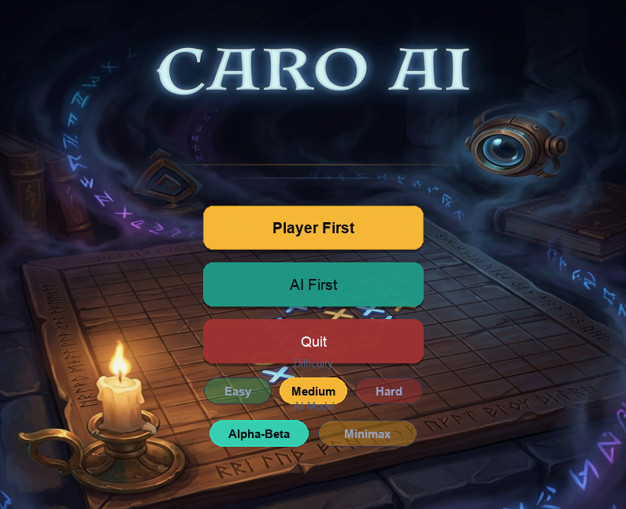
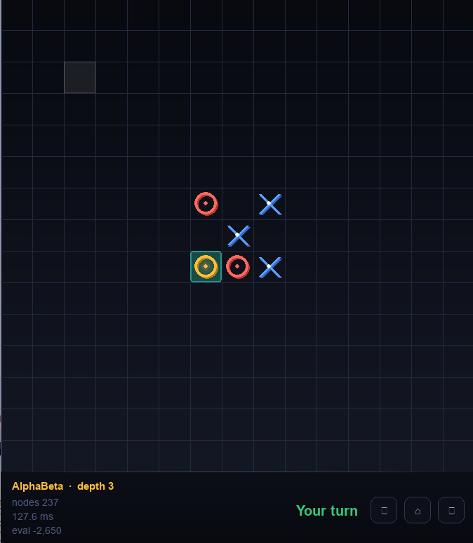

# Caro AI

Caro AI mang đến một ván cờ Caro quen thuộc với giao diện đơn giản, dễ nhìn và phần AI có thể chọn thuật toán theo nhu cầu. Người chơi có thể bắt đầu nhanh từ menu, chọn lượt đi, chọn độ khó rồi vào bàn cờ để thi đấu trực tiếp với máy.





Caro AI là chương trình chơi cờ Caro có giao diện bằng Pygame và tích hợp hai thuật toán tìm kiếm đối kháng: Minimax và Alpha-Beta Pruning. Trò chơi dùng luật thắng 5 quân liên tiếp trên bàn cờ 15x15, cho phép người chơi đấu với máy, chọn máy đi trước hoặc người đi trước, chọn độ khó và chọn thuật toán AI ngay trong giao diện.

## Tổng quan chương trình

Các thành phần chính của project:

- `caro_ai/game`: xử lý bàn cờ, luật chơi, lượt đi và kiểm tra trạng thái kết thúc.
- `caro_ai/ai`: cài đặt AI gồm Minimax, Alpha-Beta, hàm đánh giá trạng thái, sắp xếp nước đi và Zobrist hashing.
- `caro_ai/ui`: giao diện Pygame, màn hình menu, màn hình chơi và phần thiết lập.
- `caro_ai/benchmark`: các trạng thái thử nghiệm và chương trình đo benchmark giữa Minimax và Alpha-Beta.
- `docs`: báo cáo, kết quả thực nghiệm và tài liệu so sánh thuật toán.

AI hiện tại hỗ trợ:

- Chọn thuật toán: `Minimax` hoặc `Alpha-Beta`.
- Chọn độ khó:
  - `easy`: độ sâu 2.
  - `medium`: độ sâu 3.
  - `hard`: độ sâu 4.
- Kiểm tra nước thắng ngay và nước cần chặn ngay.
- Sinh nước đi ứng viên quanh các quân đã có để giảm số nhánh cần xét.
- Sắp xếp nước đi để Alpha-Beta cắt tỉa hiệu quả hơn.
- Benchmark trên các trạng thái đại diện: đầu ván, giữa ván, máy thắng ngay, người chơi sắp thắng, hai bên cùng tấn công và trạng thái có nhiều nước hợp lệ.

## Yêu cầu hệ thống

- Python 3.12 trở lên.
- `git clone `.
- Môi trường có thể chạy cửa sổ đồ họa Pygame.

Các thư viện cần thiết được cài thông qua file `requirements.txt`.
## Cài đặt chung
```
git clone https://github.com/quanai06/Caro_AI
cd Caro_AI
```
## Cài đặt trên Windows

Mở PowerShell hoặc Command Prompt tại thư mục project.

1. Tạo môi trường ảo:

```powershell
python -m venv .venv
```

2. Kích hoạt môi trường ảo:

```powershell
.\.venv\Scripts\activate
```

3. Cài thư viện:

```powershell

pip install -r requirements.txt
```

4. Chạy chương trình:

```powershell
python main.py
```

## Cài đặt trên macOS

Mở Terminal tại thư mục project.

1. Tạo môi trường ảo:

```bash
python -m venv .venv
```

2. Kích hoạt môi trường ảo:

```bash
source .venv/bin/activate
```

3. Cài thư viện:

```bash

pip install -r requirements.txt
```

4. Chạy chương trình:

```bash
python main.py
```


## Cách chơi

Sau khi chạy `python main.py`, màn hình menu của Caro AI sẽ mở ra.

Trong menu có thể chọn:

- Người chơi đi trước hoặc AI đi trước.
- Thuật toán AI: Minimax hoặc Alpha-Beta.
- Độ khó: easy, medium hoặc hard.

Trong ván chơi:

- Người chơi đánh quân `X` hoặc `O` tùy lựa chọn lượt đi.
- AI sẽ tự tính nước đi sau lượt của người chơi.
- Bên nào có 5 quân liên tiếp theo hàng ngang, dọc hoặc chéo sẽ thắng.

## Chạy benchmark

Benchmark dùng các trạng thái trong:

```text
caro_ai/benchmark/test_states.json
```

Chạy benchmark mặc định với cả ba độ sâu 2, 3 và 4:

```bash
python -m caro_ai.benchmark.runner
```

Kết quả được ghi vào:

```text
caro_ai/benchmark/results/benchmark.csv
```

Chạy benchmark cho một độ sâu cụ thể, ví dụ depth 3:

```bash
python -m caro_ai.benchmark.runner --depths 3
```

Chạy benchmark cho depth 3 và depth 4:

```bash
python -m caro_ai.benchmark.runner --depths 3 4
```

Ghi kết quả ra một file CSV khác:

```bash
python -m caro_ai.benchmark.runner --depths 3 4 --output caro_ai/benchmark/results/my_benchmark.csv
```

Các cột kết quả chính trong benchmark:

- `state_id`, `state_name`: tên trạng thái thử nghiệm.
- `difficulty`, `depth`: độ khó và độ sâu tìm kiếm.
- `metric`: chỉ số được đo, ví dụ nước đi, điểm đánh giá, số node, thời gian chạy.
- `minimax`: kết quả của Minimax.
- `alphabeta`: kết quả của Alpha-Beta.

Lưu ý: thời gian benchmark có thể khác thời gian hiển thị khi chơi thật vì giao diện Pygame, trạng thái bàn cờ hiện tại, cấu hình máy và tiến trình nền đều có thể ảnh hưởng đến thời gian AI phản hồi.

## Cấu trúc thư mục

```text
Caro_AI/
├── main.py                         # File chạy chính của chương trình
├── requirements.txt                # Danh sách thư viện cần cài
├── README.md                       # Tài liệu giới thiệu project
├── report.pdf                      # Báo cáo tổng hợp project
├── caro_ai/
│   ├── __init__.py                 # Khởi tạo package caro_ai
│   ├── app.py                      # Điều phối menu, game và UI
│   ├── modes.py                    # Khai báo các chế độ chơi
│   ├── ai/
│   │   ├── __init__.py             # Gom các lớp AI chính
│   │   ├── base_agent.py           # Lớp nền cho các AI
│   │   ├── minimax_agent.py        # AI dùng thuật toán Minimax
│   │   ├── alphabeta_agent.py      # AI dùng Alpha-Beta Pruning
│   │   ├── evaluation.py           # Hàm chấm điểm bàn cờ
│   │   ├── move_ordering.py        # Sắp xếp và chọn nước ưu tiên
│   │   └── zobrist.py              # Hash bàn cờ và lưu trạng thái
│   ├── assets/
│   │   ├── bg/
│   │   │   └── main_menu_bg.png    # Ảnh nền màn hình menu
│   │   └── ui/
│   │       ├── image.png           # Ảnh giao diện menu
│   │       └── image_2.png         # Ảnh giao diện ván chơi
│   ├── benchmark/
│   │   ├── __init__.py             # Khởi tạo package benchmark
│   │   ├── runner.py               # Chạy benchmark và ghi CSV
│   │   ├── test_states.json        # Các thế cờ dùng để test
│   │   ├── worker.py               # Khung chạy một benchmark đơn
│   │   ├── session.py              # Khung quản lý phiên benchmark
│   │   ├── report_merge.py         # Khung gộp kết quả benchmark
│   │   └── results/
│   │       └── benchmark.csv       # Kết quả benchmark đã xuất
│   ├── config/
│   │   ├── ai_settings.json        # Cấu hình mặc định cho AI
│   │   ├── game_settings.json      # Cấu hình bàn cờ và luật thắng
│   │   └── dev_mode.json           # Cấu hình hỗ trợ khi phát triển
│   ├── game/
│   │   ├── __init__.py             # Gom các thành phần game
│   │   ├── board.py                # Quản lý bàn cờ và nước đi
│   │   ├── caro.py                 # Trạng thái và luồng một ván
│   │   └── rules.py                # Kiểm tra điều kiện thắng
│   ├── ui/
│   │   ├── __init__.py             # Khởi tạo package UI
│   │   ├── asset_loader.py         # Tải ảnh, font và placeholder
│   │   ├── main_menu_clean.py      # Giao diện menu chính
│   │   ├── menu_overlay.py         # Bảng chỉnh độ khó, AI, quân
│   │   ├── pygame_ui.py            # Giao diện bàn cờ khi chơi
│   │   └── widgets.py              # Các widget UI tái sử dụng
│   └── utils/
│       ├── __init__.py             # Khởi tạo package tiện ích
│       ├── logger.py               # Ghi log kết quả ra CSV
│       └── visualizer.py           # In bàn cờ ra console
└── notebooks/
    └── analysis.ipynb              # Notebook phân tích thử nghiệm
```
